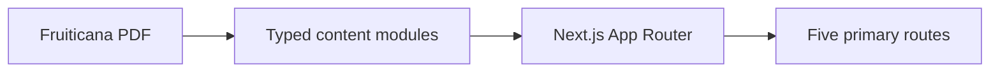

# Fruiticana Website Implementation Plan

Greenfield Next.js 16 rebuild of Fruiticana as a 2026 premium frozen-dessert brand site, using the 2003–2011 business PDF as historical source material with strict claim qualification, no fake commerce/contact data, and a 5-page consumer architecture.

**Implementation checklist**

- [ ] Phase 1 — Scaffold Next.js 16.3.3+ / TypeScript / Tailwind design tokens, fonts, and extract PDF brand crops
- [ ] Phase 2 — Build Navbar, mobile nav, Footer, SkipLink, and global layout
- [ ] Phase 3 — Implement homepage sections with real copy and replaceable photography
- [ ] Phase 4 — Create flavor data model, grid, and `/flavors/[slug]` detail pages
- [ ] Phase 5 — Build Our Story timeline, historical testimonials, and documentation cards
- [ ] Phase 6 — Transcribe historical PDF nutrition panels into labeled Nutrition UI
- [ ] Phase 7 — Build validated Contact form (no live send) and Find Fruiticana placeholder
- [ ] Phases 8–12 — Responsive, a11y, SEO/performance, QA, Render production Blueprint

---

## 1. Repository Assessment

The GitHub remote is already cloned into [C:\Users\hsins\projects\fruitiana-website](C:\Users\hsins\projects\fruitiana-website) (`https://github.com/hsinsammy1218/fruiticana-website.git`). The repo is **empty**: `main` has no commits, no `package.json`, no pages, no assets, no SEO, no forms, no APIs, no database, no analytics, and no deploy config.

There is **no existing stack to preserve**. This is a greenfield consumer site.

**Stay:** the GitHub remote and the Fruiticana name/history from the PDF.

**Change / create:** the entire application, design system, content model, and deployment config.

**Source document:** [C:\Users\hsins\Downloads\Fruiticana.pdf](C:\Users\hsins\Downloads\Fruiticana.pdf) (40 pages, ~61 MB). Pages 1–11 are narrative; pages 12–40 are scanned appendix images (FDA packet, AHA material, packaging, 12 nutrition panels + fruit comparisons, Connecticut Team Nutrition page). Text extraction cannot read those scans; logo/packaging/nutrition numbers must be cropped and transcribed during implementation from the PDF images.

**Do not commit the 61 MB PDF** into git. Extract only the needed crops into `public/history/` and `public/brand/`.

**Recommended stack (v1):**

- **Next.js 16.3.3+ (App Router)** + **React** + **TypeScript** — current Active LTS; do not start below 16.3.3 (August 2026 security release).
- **Tailwind CSS** for the design tokens and layout.
- **`next/font`** for Plus Jakarta Sans (headings) + Inter (body).
- **`next/image`** for photography; prefer **WebP**, not AVIF, until Next’s AVIF optimizer is safe again (16.3.3 currently serves AVIF unoptimized after a libheif RCE).
- **Static generation** for all marketing pages (Server Components by default; client JS only for nav, form, flavor selector, reduced-motion-aware reveals).
- **No CMS, no database, no e-commerce, no live email** in v1.
- **Contact form:** validated UI + success/error states only; submissions are **not sent** until a real inbox exists.
- **Hosting:** Render **Web Service** (Linux, bind `0.0.0.0:$PORT`) so `next/image` and a future contact API can be added without a platform migration. A `render.yaml` Blueprint will be added in the production-readiness phase. Do not use Render’s free web-service spin-down for a brand homepage if a paid instance is available; call that out at deploy time.



---

## 2. Fruiticana Brand Summary

**What it is:** Fruiticana is a fruit-based frozen dessert conceived as a smoother, ice-cream-like way to eat fruit. Original line name: **Fruiticana Creamless Ice Cream**. Original tagline: **“An exciting new way to eat fruit.”**

**Strongest 2026 consumer positioning (not investor-deck positioning):**

1. **Fruit at the center** — 12 fruit-inspired flavors, creamy texture, no fruit chunks/seeds (historical consumer language).
2. **A different frozen dessert** — created as a lactose-free, fruit-forward alternative to traditional dairy ice cream.
3. **A real origin story** — R&D from 2003; Connecticut pilot 2005–2006; independently owned parlor; school/nutrition-program participation **as history**.

**Primary homepage promise:** *Fruit. Frozen differently.* Visitors should understand in ~5 seconds: what it is, why it is different, which flavors exist, why they would try it, and where to learn more.

**Do not lead with:** disease, diabetes, FDA/AHA badges, 2010 market stats, competitor calorie-shaming, or “healthiest dessert in the world.”

**Product name on the modern site:** brand = **Fruiticana**. Category language = **fruit-based frozen dessert**. “Creamless Ice Cream” appears on Our Story as the original product name, not as the hero H1.

---

## 3. Content Audit

### Safe to use (consumer site, present tense as brand story — not as current lab/cert claims)

- Brand name Fruiticana; tagline “An exciting new way to eat fruit.”
- Original product name Fruiticana Creamless Ice Cream (as historical name).
- Founding year **2003**.
- Named team as documented only: Antoine Mowad (Chemistry); Dr. Marc Raad (Internal Medicine); Dr. Joseph Brenes (Internal Medicine/Chemistry); Dr. Joseph Morely (Cardiology); Dr. Mark L. Kraus (Internal/Addiction Medicine). Do not invent bios or “correct” the Morely spelling.
- Concept: fruit-based, smooth/creamy ice-cream-like texture.
- 12 flavor names: Apricot, Mango, Pineapple, Banana, Raisin, Strawberry, Lemonade, Blueberry, Grapefruit, Apple, Orange, Cantaloupe.
- Historical serving ideas: cup, cone, smoothie, popsicle/novelty, take-home pint, potential frozen cake.
- Short historical testimonials (taste/enjoyment only), dated and located.
- That a Connecticut pilot happened.

### Historical but usable with clear qualification

- Localized Connecticut pilot **2005–2006**.
- ~30,000 consumer sampling in Connecticut.
- Independently owned parlor; distribution to local schools.
- Connecticut Team Nutrition Healthy Snack pilot participation (Sep 30, 2003–Sep 30, 2005), USDA-funded grant to CT Dept. of Education; one of 11 vendors / 3 frozen-dessert vendors in that pilot.
- Pilot sales “close to $1 million” — **Our Story only**, labeled historical; never as current revenue.
- Historical formats/sizes: 4 oz cup, cones, smoothies, 16 oz pints; institutional 3 oz.
- Historical parlor/wholesale **prices** — do **not** show on the consumer site (they read as current menu prices). Keep in data only if needed for an internal comment, not UI.
- Appendix scans (FDA packet, AHA material, CT program page, labels, lab panels) — **Historical documentation** gallery only, never as live certification badges.
- Transcribed nutrition panels — on Nutrition page with banner: “Historical nutritional analysis — not a current product label.”
- Safe testimonial excerpts emphasizing taste, texture, fruit flavor, enjoyment.

### Requires current verification before present-tense marketing

- Whether Fruiticana is in production or sold anywhere today.
- Current formulation (dairy-free vs lactose-free vs vegan; fat-free; cholesterol-free; “100% fruit”; “no additives”; “no added sugar”).
- Current nutrition facts, serving size, ingredients lists, allergens.
- Current shelf life (PDF claimed two years).
- Current certifications, logo usage rights (FDA, AHA, ACS, AGA, AND/ADA, school programs).
- Current contact, address, phone, email, social, domain.
- Current retail / food-service / school availability.
- Whether all 12 flavors and all formats still exist.
- Logo/vector artwork ownership and preferred lockup.
- Whether founders still want their names/credentials public.

### Must not be used as a marketing claim

- “The healthiest frozen dessert available.”
- “Potential to prevent cardiovascular disease.”
- “Safe for diabetics” / diabetes treatment or suitability (including the long Waterbury review that says diabetics can eat it).
- “The only dessert certified by the American Heart Association” as a current fact.
- Present-tense “FDA certified” / “AHA endorsed” / ACS / Gastroenterology Association / American Dietary Association.
- “Just two servings a day gives you 50% to 100% of your daily fiber.”
- Outdated 2008 IDFA $4.2B ice cream sales; 2007 diabetes/obesity stats; CSPI 2003 competitor calorie attacks (Ben & Jerry’s, Cold Stone, Baskin-Robbins).
- Michelle Obama Let’s Move tie-in.
- “Revolutionary,” “no other product on the market,” “immeasurably impact the health of millions.”
- Current prices, store list, social URLs, or invented reviews.
- Unattributed “100% natural / 100% fruit / no sugar” as site voice (Lemonade is a flavor; processing is unstated).

**Testimonial policy:** Use only:

- “Great Stuff.” — Frank, Waterbury, CT, July 19, 2007
- “Great. Simply Awesome.” — Latonja, Waterbury, CT, July 19, 2007
- “Like nothing I ever tasted before.” — Shawn, Waterbury, CT, July 18, 2007
- Optional longer excerpt, truncated before medical claims: smoothness, no chunks/seeds, cup/cone/smoothie versatility.

Every testimonial block labeled: **Testimonials from Fruiticana's original Connecticut pilot.**

---

## 4. Sitemap

Primary nav (5 items):

- `/` Home
- `/flavors` Flavors
- `/story` Our Story
- `/nutrition` Nutrition
- `/contact` Contact / Find Fruiticana

Not in primary nav:

- `/flavors/[slug]` flavor detail (View Flavor)
- `/privacy` Privacy Policy
- `/terms` Terms
- `/accessibility` Accessibility

No cart, no checkout, no fake store pages.

---

## 5. Homepage Architecture

1. **Sticky nav** — wordmark, 5 links, CTA “Explore Flavors”; compact height so the hero still works above the fold.
2. **Hero** — “Fruiticana” + “An exciting new way to eat fruit.” One or two sentences: smooth, fruit-inspired frozen dessert; alternative to traditional ice cream. CTAs: Explore the Flavors / Discover Fruiticana. Full-width food photography, not a wall of text, not 100vh of empty padding.
3. **Value strip (4 cards)** — Fruit Forward; Smooth & Frozen; Dairy-Free Concept (worded as historically created as a lactose-free alternative); 12 Original Flavors.
4. **Featured flavors** — Mango, Strawberry, Pineapple, Blueberry, Orange, Cantaloupe as `FlavorCard`s; link to `/flavors`.
5. **Ice Cream, Reimagined Through Fruit** — factual contrast without competitor attacks or disease language.
6. **Enjoy it your way** — Cup, Cone, Smoothie, Frozen Pop, Take Home; caption that these are historical / potential formats, not a current menu.
7. **Story teaser** — 2003 multidisciplinary origin; CTA Read Our Story.
8. **Historical milestone teaser** — one short “Original Connecticut pilot” card; details live on Our Story.
9. **Historical testimonials** — 3 short quotes, clearly dated.
10. **Closing CTA** — “Ready for something refreshingly different?”
11. **Footer** — nav, legal, “Stay Fresh” newsletter UI (non-submitting placeholder, same pattern as contact).

---

## 6. Page-by-Page Plan

**Home (`/`)** — sections above. Conversion goals: Flavors, Story, Contact.

**Flavors (`/flavors`)** — intro + `FlavorGrid` of all 12. Filter chips optional (citrus / berry / tropical / other) from data, not a new page. Each card → `/flavors/[slug]`.

**Flavor detail (`/flavors/[slug]`)** — flavor hero with accent color, short description, historical nutrition teaser linking to `/nutrition?flavor=[slug]`, related flavors. `status` field allows `historical` vs `coming-soon` without implying current retail SKUs.

**Our Story (`/story`)** — visual timeline (2003 R&D → 2003–2005 Team Nutrition pilot → 2005–2006 CT consumer/parlor pilot → ~30,000 samples → vision for a new generation). Founders listed with documented fields only. “Proven in Connecticut” full section with historical labeling. “Our History & Documentation” cards linking to scanned appendix images (not endorsement badges). Forward-looking close without inventing 2012–2026 events.

**Nutrition (`/nutrition`)** — philosophy (fruit-forward frozen dessert; not a medical page). `NutritionSelector` for 12 flavors. `NutritionPanel` showing transcribed historical values. Persistent disclaimer. Ingredients: only what the PDF supports at a high level (“made from fruit” historically); no fabricated full ingredient lists. No disease FAQs.

**Contact (`/contact`)** — inquiry types: General, Retailers, Grocery Distribution, Food Service, Schools & Institutions, Wholesale, Partnerships, Media, Investment / Business Development. Fields: name, email, phone optional, company optional, inquiry type, message. Client-side validation, honeypot field (architecture for spam), success/error UI. Submit **does not send**; success copy explains that inquiries are not yet being delivered. Contact details are TODO placeholders, never invented. **Find Fruiticana** block: “Availability information is coming soon” + layout slot for a future map/store list.

**Legal** — short, honest placeholders: no invented address/entity; “contact details to be added.”

---

## 7. Design System

**Palette (interface):** cream `#FFF9EF`, primary green `#5FAF45`, deep green `#163D2A`, ink `#1A1A1A`, muted `#5C675F`. **Accents used only in flavor context:** mango `#F5B942`, strawberry `#EF5B5B`, blueberry `#5865A8`. Do not run all 12 fruit colors in chrome.

**Type:** Plus Jakarta Sans for display; Inter for UI/body. Scale roughly: display 40–56px, h1 32–40, h2 24–28, h3 18–20, body 16/26, small 14. Hero type strong but not so large it wastes the fold.

**Layout:** `--container` ~1120–1200px; section padding ~64–80px desktop / 40–48px mobile (not 100vh sections). 8px spacing scale. Radius 12–20px on cards, 999px on pills. Soft shadow only on hover. Buttons: Primary (deep green), Secondary (cream + green border), Ghost, Flavor (per-card, rare).

**Imagery:** bright natural-light fruit + frozen dessert; replaceable paths in data. No cartoon fruit, gym shots, or smiling-family stock. Iconography: simple line icons for formats/values (inline SVG).

**Logo:** crop/trace the PDF page 14 packaging mark if usable; otherwise a temporary wordmark in Plus Jakarta Sans that is one file swap away from a future SVG. Do not invent a new symbol.

---

## 8. Component Architecture

Reusable pieces (no one-off duplicates):

- `Navbar`, `MobileNavigation`, `Footer`
- `Button`, `Container`, `SectionHeading`, `HistoricalNotice`
- `Hero`, `FeatureCard`, `FlavorCard`, `FlavorGrid`, `FlavorHero`
- `ProductFormatCard`, `NutritionPanel`, `NutritionSelector`
- `HistoricalTimeline`, `TestimonialCard`, `TrustDocumentCard`
- `CTASection`, `ContactForm`, `StoreLocatorPlaceholder`
- `SkipLink`, `JsonLd`

Client components only where needed (menu, form, selector, hover-safe motion).

---

## 9. Data Architecture

Typed modules in `src/data/` (not scattered JSX):

```ts
// flavors.ts
slug, name, tagline, description, image, accent, status, featured, nutrition
```

`nutrition` includes `source: "historical-lab"` plus calories, fat, cholesterol, sodium, carbs, fiber, sugars, protein, vitamins, servingSize, and `disclaimer`.

Also: `testimonials.ts`, `timeline.ts`, `formats.ts`, `documents.ts`, `navigation.ts`, `site.ts` (placeholders for email/phone/address/social = `null`).

Adding a 13th flavor should be a data change, not a redesign.

---

## 10. Responsive Strategy

Mobile-first grids. Breakpoints: 320, 375, 390, 430, 768, 1024, 1280, 1440+.

- **320–430:** hamburger; hero stacked; 1-col flavors; sticky compact CTA; form single column; no horizontal overflow.
- **768:** 2-col flavor/format grids; tighter hero.
- **1024+:** 3-col featured flavors (6 cards); desktop nav; nutrition panel beside selector.

Images use `object-position` so fruit stays in frame. Tap targets ≥44px. Type scales down; headings do not clip.

---

## 11. Accessibility Strategy

Semantic landmarks and one h1 per page. Keyboardable nav (focus trap in mobile menu, Escape to close). Visible focus rings. Form labels (not placeholder-only). Alt text from flavor/format data. Contrast: deep green on cream, cream on deep green; test `#5FAF45` on cream (may need darker green for small text). `prefers-reduced-motion` disables scale/reveal. Skip link. ARIA only for menu/disclosure. Legal Accessibility page describes the intent.

---

## 12. Performance Strategy

Likely risks: large hero photography, 12 flavor images, Google fonts, accidental animation libraries.

Mitigations: `next/font` subsetting; WebP; explicit `priority` only on the hero; lazy otherwise; CSS transitions not Framer-everywhere; Server Components; no video background; sitemap of static routes. Targets: Lighthouse Performance 90+, A11y 95+, BP 95+, SEO 95+ on Home and Flavors.

---

## 13. SEO Foundation

`app/layout.tsx` metadata; unique `title`/`description` per route; canonical; Open Graph + Twitter; `sitemap.ts`; `robots.txt`; OG image from a generated or static brand card. Internal links: Home ↔ Flavors ↔ Story ↔ Nutrition ↔ Contact.

Keyword themes in natural copy only: fruit frozen dessert, fruit-based / dairy-free / lactose-free frozen dessert, healthy frozen dessert alternative — **no medical SEO**.

JSON-LD: `Organization` + `WebSite` + `BreadcrumbList`. **No** Product offers, prices, aggregate ratings, GTINs, or Review schema (testimonials are historical and must not become fake Review rich results). FAQ schema only if we add non-medical FAQs later.

---

## 14. Content / Asset Requirements (missing — do not invent)

- Vector logo / usage guidelines
- Real Fruiticana product photography (cups, cones, pints, smoothies)
- Current nutrition labels and ingredient/allergen lists
- Current certifications and permission to show marks
- Business email, phone, mailing address
- Legal entity name for Privacy/Terms
- Retail locations
- Social profiles
- Confirmation that 12 flavors and formats are still the line
- Confirmation founders should be listed publicly

**v1 substitutes:** PDF packaging crop + wordmark; licensed temporary fruit/dessert photos in `public/images/` with a `TODO: replace with product photography` comment in data; historical nutrition labeled as such.

---

## 15. Verification Checklist (owner must confirm before present-tense publish)

- Current production/sale status and markets
- Current formulation claims (lactose-free, fat-free, cholesterol-free, dairy-free, vegan, “100% fruit,” added sugar, additives)
- Current nutrition panels vs PDF labs
- Shelf life
- Which flavors/formats exist now
- FDA registration vs “certification”; AHA status and logo rights
- CT Team Nutrition / USDA / school program — historical only vs any current program
- ACS / AGA / AND claims — drop unless a current document exists
- Fiber “two servings” claim
- Pilot figures: 30,000 samples; ~$1MM sales; 50–100% profit range (profit should stay off the consumer site regardless)
- Founder names/credentials spelling and permission
- Testimonial permission / keep as clearly historical
- Pricing (keep off site until a current menu exists)
- Contact, domain, social, locations
- Logo file and trademark presentation
- Whether “Creamless Ice Cream” is still the product name

Until verified, the site speaks in **concept + history** language, not **buy it today / certified today** language.

---

## 16. Implementation Phases

### Phase 1 — Foundation / design system

- **Files:** `package.json`, `next.config.ts`, `tsconfig.json`, `src/app/globals.css`, `src/app/layout.tsx`, `src/data/site.ts`
- **Work:** scaffold Next.js 16.3.3+, Tailwind tokens, fonts, reset, `HistoricalNotice` styles. Extract PDF packaging/logo crops into `public/brand/`.
- **Deps:** none. **Risks:** empty Git history; first commit should be the scaffold. **Test:** `next dev` renders a token preview page (removed later).

### Phase 2 — Navigation + global layout

- **Files:** `Navbar`, `MobileNavigation`, `Footer`, `SkipLink`, `src/data/navigation.ts`
- **Work:** sticky nav, mobile drawer, footer with legal + disabled Stay Fresh field. **Test:** keyboard menu, 320px overflow.

### Phase 3 — Homepage

- **Files:** `src/app/page.tsx`, `Hero`, `FeatureCard`, `CTASection`, homepage section components
- **Work:** implement the 10 content sections with real copy (no lorem). Temporary photography. **Test:** fold at 390/1280; both CTAs; no 100vh empty sections.

### Phase 4 — Flavor system

- **Files:** `src/data/flavors.ts`, `FlavorCard`, `FlavorGrid`, `FlavorHero`, `src/app/flavors/page.tsx`, `src/app/flavors/[slug]/page.tsx`
- **Work:** 12 flavors, 6 featured, generateStaticParams, accent CSS variables. **Test:** all slugs, related flavors, back to grid.

### Phase 5 — Our Story

- **Files:** `timeline.ts`, `testimonials.ts`, `documents.ts`, `HistoricalTimeline`, `TestimonialCard`, `TrustDocumentCard`, `src/app/story/page.tsx`
- **Work:** qualified history; appendix image cards; no invented 2012–2026 chapter. **Test:** timeline readability on mobile; historical labels visible.

### Phase 6 — Nutrition

- **Files:** `NutritionPanel`, `NutritionSelector`, `src/app/nutrition/page.tsx`, nutrition fields on `flavors.ts`
- **Work:** transcribe PDF panels (pp. 15–37) into data; query-param deep link from flavor pages; persistent historical disclaimer. **Risks:** OCR/transcription error — double-check every number against the PDF. **Test:** each of 12 flavors; disclaimer not dismissible-hidden.

### Phase 7 — Contact / store locator

- **Files:** `ContactForm`, `StoreLocatorPlaceholder`, `src/app/contact/page.tsx`
- **Work:** validation + honeypot + success/error; no API; coming-soon availability. **Test:** invalid email, empty message, keyboard submit, success state.

### Phase 8 — Responsive refinement

- **Work:** pass listed widths; fix clipping, sticky nav overlap, card density, image focal points. **Test:** Chrome device mode + real layout screenshots.

### Phase 9 — Accessibility

- **Work:** axe on all routes, focus order, reduced motion, alt text, contrast tweaks. **Test:** keyboard-only pass; screen-reader landmarks.

### Phase 10 — Performance + technical SEO

- **Files:** `sitemap.ts`, `robots.ts`, `opengraph-image`, `JsonLd`, metadata on every page
- **Work:** image compression, font subset, Lighthouse Home + Flavors. **Test:** Lighthouse thresholds; view-source titles/canonicals.

### Phase 11 — Cross-browser QA

- **Work:** Chromium, Firefox, WebKit; no layout bugs in nav/form/nutrition. **Test:** checklist of all 5 primary routes + 2 flavor details + legal.

### Phase 12 — Production readiness

- **Files:** `render.yaml`, `.gitignore`, `README` with owner verification checklist, Privacy/Terms/Accessibility pages
- **Work:** Render Web Service Blueprint, `0.0.0.0` + `PORT`, env placeholders only. No fake analytics IDs. **Test:** production build locally; confirm no present-tense cert/store/price claims remain.

**Explicit non-goals for v1:** checkout, live form delivery, map API, CMS, invented social, AHA/FDA badges in the hero, competitor nutrition warfare, medical claims.
